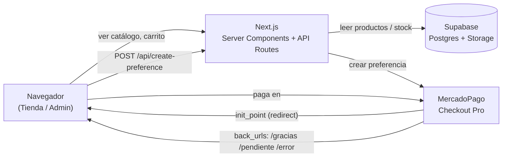
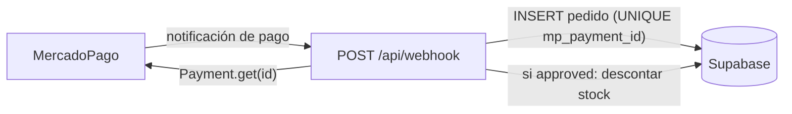

# FINALOOK STUDIO

Tienda de denim con estética editorial oscura. E-commerce construido con Next.js (App Router), datos en Supabase y pagos con MercadoPago.

## Stack

- **Next.js 16** (App Router, Server Components, Route Handlers)
- **React 19** + **TypeScript**
- **Supabase** (Postgres) — productos, pedidos y reseñas
- **MercadoPago** — checkout y webhook de pagos
- **Vercel** — deploy

## Características

- Catálogo de productos leído desde Supabase (con fallback a JSON local).
- Carrito con envío dinámico (Argentina / Internacional) y cupones de descuento.
- Stock por talle: badges de "últimas unidades" y talles agotados.
- Checkout con MercadoPago; el webhook guarda el pedido y descuenta stock al aprobarse el pago.
- Reseñas por producto (promedio, listado y formulario) persistidas en Supabase.
- Guía de talles, productos relacionados, prueba social y botón flotante de WhatsApp.
- Panel admin (`/admin`) para gestionar productos, stock, cupones, pedidos y subir imágenes.

## Arquitectura

Flujo general: el navegador habla con el server de Next.js (Server Components +
Route Handlers), que a su vez consulta Supabase (Postgres + Storage) y MercadoPago.



Flujo del webhook (asíncrono, lo dispara MercadoPago al confirmarse el pago):



El `UNIQUE` sobre `mp_payment_id` hace el webhook idempotente: si MercadoPago
reintenta la misma notificación, el segundo insert falla (23505) y no se vuelve
a descontar stock ni se duplica el pedido.

## Requisitos previos

- Node.js 20+
- Una cuenta de Supabase con un proyecto creado
- Credenciales de MercadoPago (access token y public key)

## Instalación paso a paso

1. Clonar el repo e instalar dependencias:

   ```bash
   git clone https://github.com/josefinacastaneda/ProgramacionWeb.git
   cd ProgramacionWeb
   npm install
   ```

2. Crear `.env.local` en la raíz con las variables de entorno (ver abajo).

3. Crear las tablas en Supabase. Necesitás la connection string de Postgres
   (Dashboard → Project Settings → Database → Connection string → URI),
   agregala como `SUPABASE_DB_URL` en `.env.local` y corré:

   ```bash
   npm run migrate
   ```

   > Alternativa: pegar `supabase/migrations/001_initial.sql` en el SQL Editor
   > del dashboard de Supabase y ejecutarlo a mano.

4. Cargar los datos iniciales (productos y reseñas) en Supabase:

   ```bash
   npm run seed
   ```

5. Correr en local:

   ```bash
   npm run dev
   ```

   Abrir [http://localhost:3000](http://localhost:3000).

## Variables de entorno

Crear `.env.local` con (solo los nombres, sin valores reales):

```
# MercadoPago
NEXT_PUBLIC_MP_PUBLIC_KEY
MP_ACCESS_TOKEN

# URL pública del sitio (para back_urls y notification_url del webhook)
NEXT_PUBLIC_BASE_URL

# Supabase
NEXT_PUBLIC_SUPABASE_URL
NEXT_PUBLIC_SUPABASE_ANON_KEY
SUPABASE_SERVICE_ROLE_KEY

# Solo para correr la migración (npm run migrate)
SUPABASE_DB_URL
```

## Scripts disponibles

| Script            | Descripción                                            |
| ----------------- | ------------------------------------------------------ |
| `npm run dev`     | Servidor de desarrollo                                 |
| `npm run build`   | Build de producción                                    |
| `npm run start`   | Sirve el build de producción                           |
| `npm run lint`    | Linter                                                 |
| `npm run migrate` | Crea las tablas en Supabase (requiere SUPABASE_DB_URL) |
| `npm run seed`    | Carga productos y reseñas en Supabase                  |

## Webhook de MercadoPago

El endpoint `POST /api/webhook` recibe las notificaciones de pago. Cuando el
pago queda `approved`, guarda el pedido en la tabla `pedidos` y descuenta el
stock del talle comprado en `productos`. Configurá la URL pública
`<tu-dominio>/api/webhook` en el panel de MercadoPago. En producción se envía
automáticamente como `notification_url` al crear la preferencia.

## Panel admin (`/admin`)

Panel protegido por contraseña (header `x-admin-password`, definida en
`ADMIN_PASSWORD`). Permite:

- Crear, editar, activar/desactivar productos y ajustar stock por talle.
- Subir imágenes a Supabase Storage (bucket `productos`).
- Crear cupones de descuento y revisar los pedidos recibidos.

## CI/CD

`.github/workflows/ci.yml` corre `npm install` y `npm run build` en cada push.
Si el build falla, el pipeline falla.

## Deploy en Vercel

Deploy: _(pendiente de configurar — reemplazar por la URL real del proyecto en Vercel)_

Para desplegar, importá el repo en Vercel y cargá las variables de entorno
listadas arriba en Project Settings → Environment Variables.
